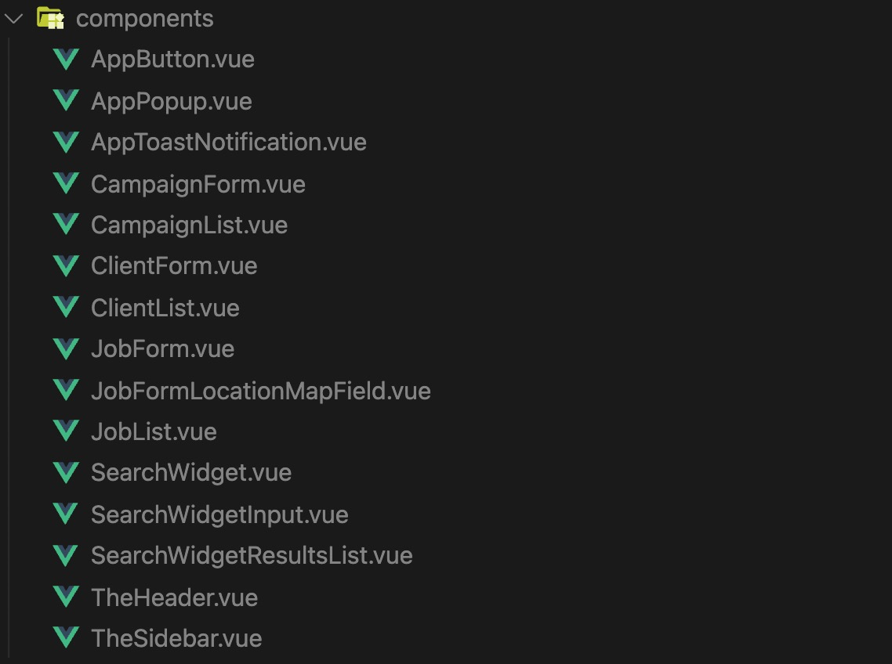
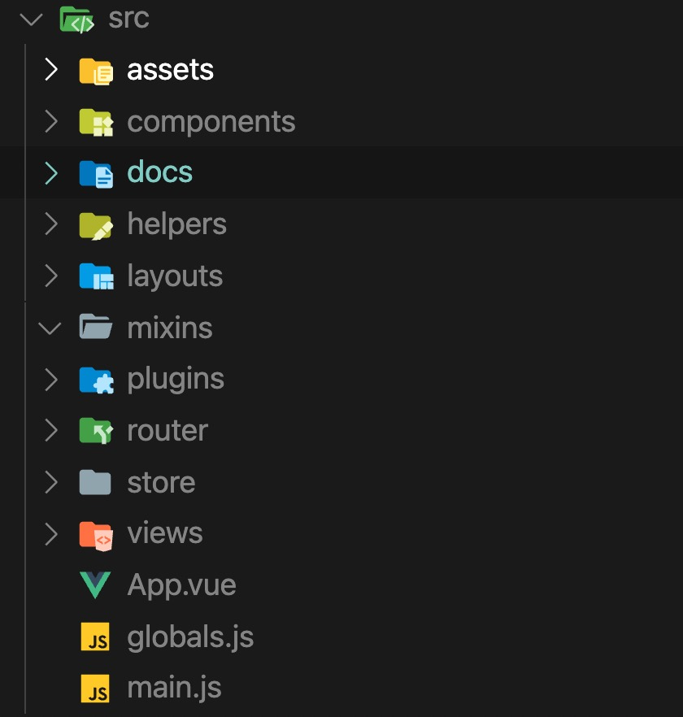

## Introduction

Quelle est la meilleure façon de **structurer une application Vue.js** pour qu'elle reste maintenable et extensible au fur et à mesure qu'elle évolue ? C'est une question que je me suis posée et que j'ai entendue à de nombreuses reprises et je pense que la réponse à cette question n'est pas des plus simples. Lorsqu'il s'agit de créer un projet évolutif, nous voudrions avoir tout prévu et que tout soit **sous contrôle.**

D'après mon expérience et ce que j'ai pu lire et voir au cours de mes projets, la clé **c'est la simplicité.**

Pourquoi est-ce important ? Eh bien, comme moi, vous avez probablement eu l'occasion de reprendre un vieux projet ou de vous greffer à un projet en cours de développement, vous ouvrez le code et vous vous dites : "Je ne sais même pas par où commencer !".

**Une base de code simple** vous permettra de ne plus vous retrouver dans cette situation, ce qui facilite l'intégration de nouveaux développeurs aux projets et rend le travail continu plus efficace.

Avant de rentrer dans le vif du sujet, il est important de noter que cette méthode n'est pas universelle. C'est simplement un partage et c'est adaptable et  perfectible. Si vous avez des remarques ou des idées d'améliorations, n'hésitez pas à m'en parler sur [Linkedin](https://www.linkedin.com/in/alexandre-le-corre/)

### 📂 Structure de fichier standard

Bien que Vue n'ait pas de documentation spécifiant **une structure particulière**, elle fournit un bon point de départ avec la base de code générée par [Vue CLI](https://cli.vuejs.org/).

La plupart d'entre nous connaissent probablement cette structure et c'est génial ! Cela signifie que nous sommes **sur une structure standard** avec laquelle nous sommes familiers. De manière générale, ne vous éloignez **surtout** pas de cette organisation à part si vous avez vraiment une bonne raison.

### 📜 Règles recommandées pour les composants

Pour la suite, il est essentiel de connaître les conventions et nomenclatures concernant Vue pour qu'on soit sur la même **longueur d'onde**. Conventions de nommage des composants, erreurs à éviter... tout est centralisé sur la documentation officielle : [ICI](https://vuejs.org/v2/style-guide/)

### 🗂 Composants de type Flat

Pour toutes les raisons évoquées ci-dessus, je suggère d'adopter la norme d'un répertoire de composants de type **Flat**. Cela représente les avantages suivants :

- Accédez rapidement et facilement à un composant dans Vue devtools ou la recherche du fichier dans la base de code (le nom du fichier et le nom du composant sont les mêmes)

- Utilisez la fonction de recherche rapide dans votre IDE pour filtrer les fichiers en fonction de leur attribut du plus général jusqu'au plus spécifique.

- Supprimez la paralysie de l'analyse lorsqu'il s'agit de décider comment organiser les composants en répertoires.

- Possibilité de voir tous vos composants à la fois dans une seule liste.
Débarrassez-vous de la redondance des mots-clés dans les noms de fichiers ET dans le répertoire (c'est-à-dire post/PostList.vue, post/PostFeature.vue, etc.)

- Supprimez la tentation d'utiliser des noms de composants courts composés d'un mot, ce qui est plus facile à faire avec des répertoires imbriqués (c'est-à-dire post/List.vue, post/Feature.vue ) et ne suit pas le Style Guide de Vue.

- Éliminez la navigation dans la structure des dossiers pour trouver un composant

- Simplifiez l'importation des composants (tous les composants seront importés comme ça : "@/MonComposant")

Bon, à quoi ressemble une structure "Flat"" qui suit le Style Guide de Vue ? Voici un bon exemple :

Bien que votre application puisse évidemment avoir **beaucoup plus de fichiers**, ce n'est pas pénalisant et vous retrouverez tous les composants de votre application dans une seule liste **bien organisée**.

### 🎯 Convention de nommage des routes et pages

Une autre pratique qui a du sens est de nommer nos routes comme nos composants de page. Dans une application CRUD typique, vous avez les différentes pages suivantes pour chaque ressource :

- une liste de toutes les ressources
- la vue d'une seule ressource
- un formulaire pour créer la ressource
- un formulaire pour modifier la ressource

J'ai l'habitude de travailler avec le **framework PHP Laravel**, je me suis donc intuitivement calqué sur les normes que Laravel avait déjà mises en place. Cela permettra à **votre équipe Backend utilisant Laravel** de travailler plus rapidement et intuitivement avec Vue.

En prenant comme exemple une ressource "user", la convention que je recommande est la suivante :

Bien que j'ai été tenté de nommer la route exactement comme avec Laravel `users.index` au lieu de `UsersIndex`, j'ai constaté que l'utilisation du PascalCase fonctionnait tout aussi bien et présentait l'avantage supplémentaire de faire correspondre le nom du composant.

Pour plus de cohérence et de flexibilité, vous devez également toujours référencer vos routes via leur nom lorsque vous les utilisez dans les Router Links :

`<router-link :to="{name: 'UsersIndex'}">Liste des utilisateurs</router-link>`

Il faut noter que toutes les routes ne correspondront pas exactement à ce modèle, car certaines ne seront pas « Crud friendly ». Pour ces routes qui ne correspondent pas au modèle CRUD, ma seule recommandation est de continuer à **utiliser le PascalCase** pour le nom de votre route.

### Autres dossiers utilitaires

Voici à quoi ressemblerait la structure finale d'un large projet Vue :

Les répertoires ajoutés ici sont **docs, helpers, layouts, mixins** et **plugins**. Vous remarquerez que 4 sur 5 ont une icône spéciale fournie par l'extension VS Code [Material Icon Theme](https://marketplace.visualstudio.com/items?itemName=PKief.material-icon-theme). En effet, pour certains frameworks ou langages, ces conventions de répertoires sont suffisamment courantes pour avoir leur propre icône aux yeux du développeur de l'extension. Ce n'est pas un hasard !

J'ai également ajouté un fichier **globals.js**.

Voici à quoi servent ces dossiers :

- **docs**

Le but de celui-ci est évident, il est inclus dans le projet car il permet à votre équipe de consulter la documentation à chaque fois que les développeurs ouvrent leur IDE, c'est plus simple. J'ai également découvert qu'écrire une documentation avant de coder une classe ou un composant réutilisable m'aide généralement à mieux concevoir l'API.

De plus, en plus du répertoire docs, je pense que c'est utile de fournir un fichier `README.md` à la racine de chaque répertoire expliquant le but de celui-ci et les règles concernant ce qui devrait y être inclus. Je me suis inspiré de [Nuxt](https://fr.nuxtjs.org/) pour ça.

- **helpers**

Il s'agit d'un répertoire souvent utilisé dans les frameworks pour les fonctions de base qui sont réutilisables tout au long du projet. Vous pouvez y inclure un simple fichier `index.js` regroupant toutes vos fonctions ou plusieurs fichiers distincts comme `https.js`, `cache.js`, `time.js`...

- **layouts**

Je me suis encore inspiré de Nuxt ainsi que de Laravel pour ce dossier. Il peut être pratique de définir non seulement des composants de page, mais également des composants de layout pouvant être réutilisés sur plusieurs pages. Au lieu de définir le contenu de la page, ces composants définissent davantage la mise en page générale. Par exemple, s'agit-il d'une page à une colonne ou à deux colonnes ? Est-ce qu'il y a une barre latérale gauche ou une barre latérale droite ? La mise en page comprend-elle une en-tête et un pied de page...

- **mixins**

Comme son nom l'indique, ce dossier regroupe tous les mixins de votre application Vue.

- **plugins**

La dernier répertoire permet d'inclure tous les plugins. En effet avec tous les packages que vous pouvez télécharger et configurer, il est important de pouvoir ranger ces configurations dans un reportoire spécifique.

- **globals.js**

Ce fichier va permettre d'enregistrer les variables globales réutilisables dans toute l'application, exemple :

Vue 2 :

`Vue.prototype.$http = () => {}`

Vue 3 :

`const app = createApp({})`
`app.config.globalProperties.$http = () => {}`

### Conclusion

Bien qu'il existe certaines normes qu'il ne faut pas ignorer, Vue vous laisse très libre quant à la structure de votre application. C'est à la fois **une bonne et une mauvaise chose**. Il existe autant de modèles possibles que de développeurs mais je vous encourage à tester cette structure dans votre prochain gros projet et vous pourrez me dire ce que vous en pensez.

Je vous encourage également à tester le framework [Nuxt](https://fr.nuxtjs.org/) qui est très robuste et impose une **structure claire et précise** permettant d'avoir une expérience agréable avec Vue.

***Cet article est susceptible d'être modifié ou complété.***
